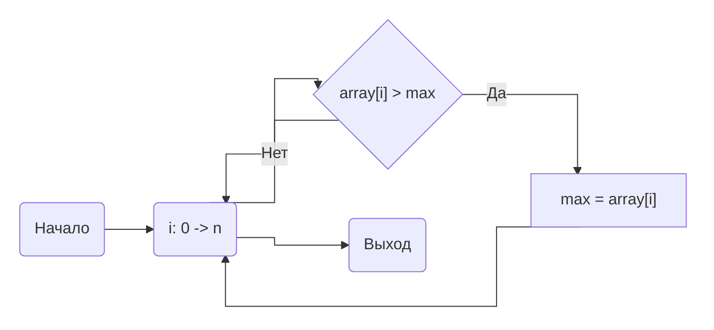
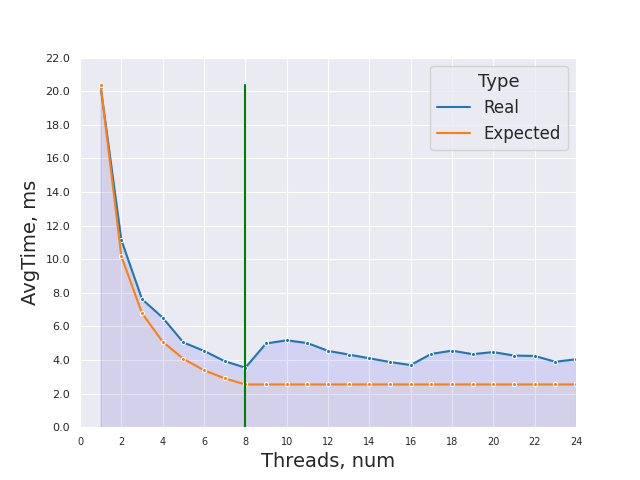
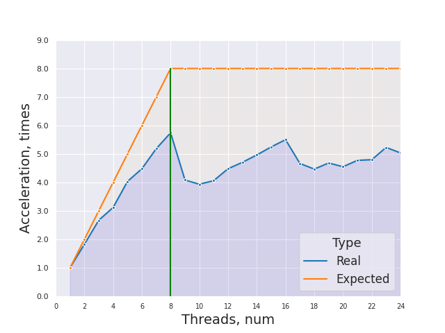
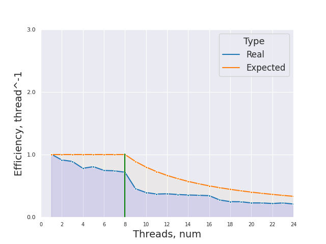

# НИЯУ МИФИ. Лабораторная работа №1. Воронков Андрей, Б20-505. 2022

## Используемая система

```
5.19.6-arch1-1 x86_64

CPU:
  Info: quad core model: Intel Core i7-8550U bits: 64 type: MT MCP cache:
    L2: 1024 KiB
  Speed (MHz): avg: 2000 min/max: 400/4000 cores: 1: 2000 2: 2000 3: 2000
    4: 2000 5: 2000 6: 2000 7: 2000 8: 2000
```
## Среда разработки 

- Язык программирования C
- Версия gcc: `gcc (GCC) 12.2.0`
- Версия OpenMP: `Release: 201511 OpenMP: 4.5`


## Анализ алгоритма 

### Принцип работы

Приложенный алгоритм идет по массиву чисел и сравнивает их с текущим максимумом для данного треда. Если элемент оказывается больше, то в переменную max записывается значение этого элемента. После выполнения итерационной части треда, полученное внутри треда значение max сравнивается с max из shared области и из них выбирается наибольший. Таким образом наибольший элемент будет в max из shared области.

### Блок-схема





### Оценка сложности

**n** - количество чисел в массиве

**p** - количество тредов

- Сложность параллельного алгоритма - **O(n/p)**

- Сложность последовательного алгоритма - **O(n)**

- Теоретическое ускорение - **O(n)** 

### Используемые директивы OpenMP

`
#pragma omp parallel num_threads(threads) shared(array, count) reduction(max: max) default(none)
`

**pragma omp parallel** - задается параллельная область для следующего за ней структурированного блока

**num_threads(threads)** - явно задается
количество потоков, которые будут выполнять параллельную работу 

**shared(array, count)** - задает общие переменные для потоков (используется для наглядности, ибо и без нее все переменные, объявленные вне параллельной области, являются общими)

**reduction(max:max)** - для переменной max создаются локальные копии в каждом потоке, а после выполнения всех операторов в параллельной области выполняется заданный оператор (в данном случае - находится максимум)

**default(none)** - всем переменным в параллельной области, которым явно не назначен класс, будет назначен указанный в аргументе класс

`#pragma omp for`

**#pragma omp for** - при выполнении цикла for в параллельном регионе итерации цикла должны быть рапределены между потоками

## Вычисления

- Последовательный алгоритм
    - Average number of operations 10000016
    - Average time of work 0.020356 seconds

- Параллельный алгортим
    - [Результаты работы](scripts/parallel_results.txt)

## Экспериментальные данные

### Зависимость времени от количества потоков



### Зависимость ускорения от количества потоков




### Зависимость эффективности работы программы от количества потоков




## Заключение

В ходе данной работы с использованием библиотеки OpenMP в языке программирования C было установлено то, что реальное время работы и ускорение за счет использования нескольких тредов может отличаться от ожидаемого времени работы программы. По графикам видно, что после 8 тредов мы не получаем выигрыша в ускорении.

## Приложение

### Исходный код последовательной программы

```c
#include <stdio.h>
#include <stdlib.h>
#include <omp.h>

int main(int argc, char** argv)
{
    const int count = 10000000;     ///< Number of array elements
    const int threads = 16;         ///< Number of parallel threads to use
    const int random_seed = 123123; ///< RNG seed
    const int attempts = 50; 

    int* array = 0;                 ///< The array we need to find the max in
    int  max;              ///< The maximal element
    int operations = 0;
    /* Initialize the RNG */
    srand(random_seed);

    /* Generate the random array */
    array = (int*)malloc(count*sizeof(int));
    for(int j=0; j < attempts; j++){
        max = -1;
        for(int i = 0; i < count; i++) { array[i] = rand(); }
        for(int i = 0; i < count; i++){            
            if (array[i] > max){
                max = array[i];
                operations++;
            } 
            operations++;
        }
    }
    printf("Average number of operations %d\n", operations / attempts);
    
    double start_time, end_time, total = 0;
    for(int j=0; j < attempts; j++){
        max = -1;
        for(int i = 0; i < count; i++) { array[i] = rand(); }
        start_time = omp_get_wtime();
        for(int i = 0; i < count; i++){            
            if (array[i] > max){
                max = array[i];
            } 
        }
        end_time = omp_get_wtime();
        total += end_time - start_time;
    }
    
    printf("Average time of work %f seconds\n", total / (double)attempts);


    free(array);    
    return(0);
}
```

### Исходный код параллельной программы с количеством тредов от 1 до 24

```c
#include <stdio.h>
#include <stdlib.h>
#include <omp.h>

int main(int argc, char** argv)
{
    const int count = 10000000;     ///< Number of array elements
    const int threads = 16;         ///< Number of parallel threads to use
    const int random_seed = 123123; ///< RNG seed
    const int attempts = 50; 
    const int thread_limit = 25;

    int* array = 0;                 ///< The array we need to find the max in
    int  max;              ///< The maximal element
    int operations = 0;
    /* Initialize the RNG */
    srand(random_seed);

    /* Generate the random array */
    array = (int*)malloc(count*sizeof(int));
    
    double start_time, end_time, total;
    for(int threads = 1; threads < thread_limit; threads++){
        total = 0;
        for(int j=0; j < attempts; j++){
            max = -1;
            for(int i = 0; i < count; i++) { array[i] = rand(); }
            start_time = omp_get_wtime();
            #pragma omp parallel num_threads(threads) shared(array, count) reduction(max: max) default(none)
            {
                #pragma omp for
                for(int i = 0; i < count; i++){            
                    if (array[i] > max){
                        max = array[i];
                    } 
                }
            }
            end_time = omp_get_wtime();
            total += end_time - start_time;
        }
        printf("%d threads worked for %f\n", threads, total / (double)attempts);
    }

    free(array);    
    return(0);
}
```

    
