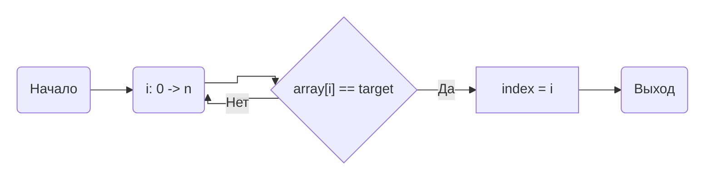
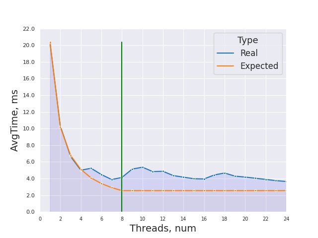
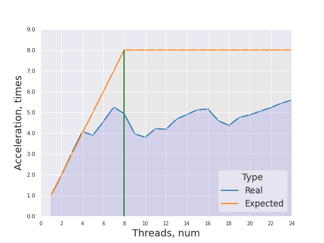
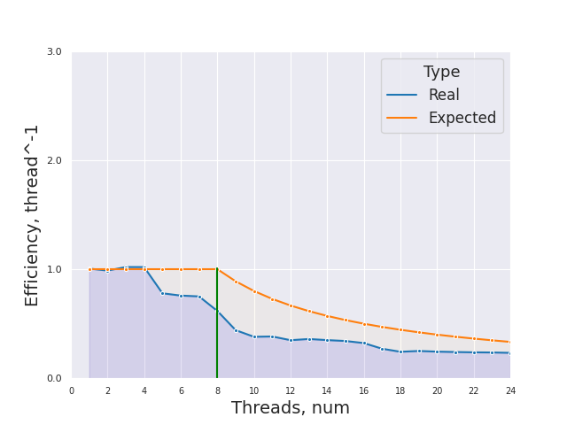

# НИЯУ МИФИ. Лабораторная работа №1. Воронков Андрей, Б20-505. 2022

## Используемая система

```
5.19.6-arch1-1 x86_64

CPU:
  Info: quad core model: Intel Core i7-8550U bits: 64 type: MT MCP cache:
    L2: 1024 KiB
  Speed (MHz): avg: 2000 min/max: 400/4000 cores: 1: 2000 2: 2000 3: 2000
    4: 2000 5: 2000 6: 2000 7: 2000 8: 2000
```
## Среда разработки 

- Язык программирования C
- Версия gcc: `gcc (GCC) 12.2.0`
- Версия OpenMP: `Release: 201511 OpenMP: 4.5`


## Анализ алгоритма 

### Принцип работы

Приложенный алгоритм идет по массиву чисел и сравнивает их с искомым (с target). Если элемент оказывается равен искомому, то в index сохраняется индекс данного элемента, а цикл завершается. Иначе цикл продолжает работу. Если искомый элемент не был найден в массиве, то индекс остается равным -1.

### Блок-схема





### Оценка сложности

**n** - количество чисел в массиве

**m** - количество элементов в массив равных искомому target

**p** - количество тредов


- Сложность последовательного алгоритма
    - В лучшем случае: **O(1)**
    - В худшем случае: **O(n)**
    - В среднем: **O(n/2)**    

- Сложность параллельного алгоритма - **O(n/p)** в среднем (обяазтельно пройти весь массив)
- Теоретическое ускорение возможно в случае, когда: `n/2**m > n/p `, то есть при p > `2**m` (в среднем m = 1)

### Используемые директивы OpenMP

`
#pragma omp parallel num_threads(threads) reduction(min: index)
`

**pragma omp parallel** - задается параллельная область для следующего за ней структурированного блока

**num_threads(threads)** - явно задается
количество потоков, которые будут выполнять параллельную работу 

**reduction(min: index)** - для переменной max создаются локальные копии в каждом потоке, а после выполнения всех операторов в параллельной области выполняется заданный оператор (в данном случае - находится максимум)

`#pragma omp for`

**#pragma omp for** - при выполнении цикла for в параллельном регионе итерации цикла должны быть рапределены между потоками

## Вычисления

- Последовательный алгоритм
    - Average time of work 0.020368 seconds
    - Average time of work 0.010239 seconds (если target есть в данном массиве и он 1)    

- Параллельный алгортим
    - [Результаты работы](scripts/parallel_results.txt) 

## Экспериментальные данные

### Зависимость времени от количества потоков



### Зависимость ускорения от количества потоков




### Зависимость эффективности работы программы от количества потоков




## Заключение

В ходе данной работы с использованием библиотеки OpenMP в языке программирования C было установлено то, что нельзя использовать `break` в цикле OpenMP и то, что при распараллеливании задачи при определенных условиях время будет увеличиваться, так как стандартный алгоритм будет эффективнее. (см. раздел оценки сложности)

## Приложение

### Исходный код последовательной программы

```c
#include <stdio.h>
#include <stdlib.h>
#include <omp.h>

int main(int argc, char** argv)
{
    const int count = 10000000;     ///< Number of array elements
    const int random_seed = 123123; ///< RNG seed
    const int attempts = 25; 
    const int thread_limit = 25;
    const int target = 1337;


    int* array = 0;                 ///< The array we need to find the max in
    int  index;              ///< The maximal element
    /* Initialize the RNG */
    srand(random_seed);

    /* Generate the random array */
    array = (int*)malloc(count*sizeof(int));
    
    double start_time, end_time, total = 0;

    for(int j=0; j < attempts; j++){
        index = -1;
        for(int i = 0; i < count; i++) { array[i] = rand(); }
        start_time = omp_get_wtime();
        for(int i = 0; i < count; i++){           
            if (array[i] == target){
                index = i;
                break;
            } 
        }
        end_time = omp_get_wtime();
        total += end_time - start_time;
    }
    printf("Average time of work %f seconds\n", total / (double)attempts);

    free(array);    
    return(0);
}
}
```

### Исходный код параллельной программы с количеством тредов от 1 до 24

```c
#include <stdio.h>
#include <stdlib.h>
#include <omp.h>

int main(int argc, char** argv)
{
    const int count = 10000000;     ///< Number of array elements
    const int random_seed = 123123; ///< RNG seed
    const int attempts = 25; 
    const int thread_limit = 25;
    const int target = 1337;

    int* array = 0;                 ///< The array we need to find the max in
    int  index;              ///< The maximal element
    /* Initialize the RNG */
    srand(random_seed);

    /* Generate the random array */
    array = (int*)malloc(count*sizeof(int));
    
    double start_time, end_time, total;
    for(int threads = 1; threads < thread_limit; threads++){
        total = 0;
        for(int j=0; j < attempts; j++){
            index = -1;
            for(int i = 0; i < count; i++) { array[i] = rand();}
            start_time = omp_get_wtime();
            #pragma omp parallel num_threads(threads) reduction(min: index)
            {
                #pragma omp for
                for(int i = 0; i < count; i++){     
                    if (array[i] == target){
                        index = i;
                        // break; Cant use break in OpenMP loop
                    } 
                }
            }
            end_time = omp_get_wtime();
            total += end_time - start_time;
        }
        printf("%d threads worked for %f\n", threads, total / (double)attempts);
    }

    free(array);    
    return(0);
}
```

    
