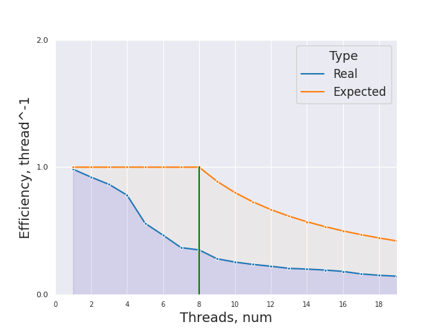

# НИЯУ МИФИ. Лабораторная работа №3. Воронков Андрей, Б20-505. 2022

## Используемая система

```
5.19.6-arch1-1 x86_64

CPU:
  Info: quad core model: Intel Core i7-8550U bits: 64 type: MT MCP cache:
    L2: 1024 KiB
  Speed (MHz): avg: 2000 min/max: 400/4000 cores: 1: 2000 2: 2000 3: 2000
    4: 2000 5: 2000 6: 2000 7: 2000 8: 2000
```
## Среда разработки 

- Язык программирования C
- Версия gcc: `gcc (GCC) 12.2.0`
- Версия OpenMP: `Release: 201511 OpenMP: 4.5`


## Анализ алгоритма 

### Принцип работы

### Блок-схема


### Оценка сложности

- Лучший случай **O(n*log(n))**, когда массив отсортирован
- Худший случай **O(n^2)** (этот случай имеет место для N, равного степени двойки, когда элементы, большие и меньшие медианы, занимают нечетные и четные позиции соответственно, поскольку они сравниваются только на последнем проходе.)


### Используемые директивы OpenMP

`
#pragma omp parallel for shared(a,m,n) private (i) num_threads(threads)
`

**pragma omp parallel** - задается параллельная область для следующего за ней структурированного блока

**num_threads(threads)** - явно задается
количество потоков, которые будут выполнять параллельную работу 

**shared(a, m, n)** - явным образом определяет список переменных, которые должны быть общими для всех нитей параллельной области

**private(i)** - Определяет список переменных, которые должны быть локальными для каждого треда. При входе в параллельную область для каждого треда создается отдельный экземпляр переменной, который не имеет никакой связи с оригинальной переменной вне параллельной области. Изменение значения локальной переменной каким-либо тредом ни как не влияет на значения этой переменной в других тредах

`#pragma omp for`

**#pragma omp for** - при выполнении цикла for в параллельном регионе итерации цикла должны быть рапределены между потоками

## Вычисления

- Последовательный алгоритм
    - Average time of work 0.318274 seconds

- Параллельный алгортим
    - [Результаты работы](scripts/parallel_results.txt) 

## Экспериментальные данные

### Зависимость времени от количества потоков


### Зависимость ускорения от количества потоков


### Зависимость эффективности работы программы от количества потоков




## Заключение

В ходе данной работы с использованием библиотеки OpenMP в языке программирования C я алгоритм сортировки Шелла. Ускорение возможно, потому что в сортировке вставками происходят вставками для элементов отстающих друг от друга на фиксированную величину stride, а следовательно все элементы в диапазоне длины stride не пересекаются. Также наглядно подтверждается то, что гипертрединг негативно влияет на эффективность увеличения количества тредов.

## Приложение

### Исходный код последовательной программы

```c
#include <stdio.h>
#include <stdlib.h>
#include <omp.h>


void insertionsort(int a[], int n, int stride) {
    for (int j=stride; j<n; j+=stride) {
        int key = a[j];
        int i = j - stride;
        while (i >= 0 && a[i] > key) {
            a[i+stride] = a[i];
            i-=stride;
        }
        a[i+stride] = key;
    }
}

void shellsort(int a[], int n)
{
    int i, m;
    for(m = n/2; m > 0; m /= 2)
    {
            for(i = 0; i < m; i++)
                insertionsort(&(a[i]), n-i, m);
    }
}

int main(int argc, char** argv)
{
    const int count = 1000000;     ///< Number of array elements
    const int random_seed = 123123; ///< RNG seed
    const int attempts = 20; 
    const int thread_limit = 20;


    /* Initialize the RNG */
    srand(random_seed);
    
    int* array = 0; 
    /* Generate the random array */
    array = (int*)malloc(count*sizeof(int));
    
    double start_time, end_time, total = 0;

    for(int j=0; j < attempts; j++){
        for(int i = 0; i < count; i++) { array[i] = rand(); }
        start_time = omp_get_wtime();
        shellsort(array, count);
        end_time = omp_get_wtime();
        total += end_time - start_time;
    }
    printf("Average time of work %f seconds\n", total / (double)attempts);

    free(array);    
    return(0);
}
```

### Исходный код параллельной программы с количеством тредов от 1 до 2

```c
#include <stdio.h>
#include <stdlib.h>
#include <omp.h>


void insertionsort(int a[], int n, int stride) {
    for (int j=stride; j<n; j+=stride) {
        int key = a[j];
        int i = j - stride;
        while (i >= 0 && a[i] > key) {
            a[i+stride] = a[i];
            i-=stride;
        }
        a[i+stride] = key;
    }
}

void shellsort(int a[], int n, int threads)
{
    int i, m;
    for(m = n/2; m > 0; m /= 2)
    {
            #pragma omp parallel for shared(a,m,n) private (i) num_threads(threads)
            for(i = 0; i < m; i++)
                insertionsort(&(a[i]), n-i, m);
    }
}

int main(int argc, char** argv)
{
    const int count = 1000000;     ///< Number of array elements
    const int random_seed = 123123; ///< RNG seed
    const int attempts = 20; 
    const int thread_limit = 20;


    /* Initialize the RNG */
    srand(random_seed);
    
    int* array = 0; 
    /* Generate the random array */
    array = (int*)malloc(count*sizeof(int));
    
    double start_time, end_time, total = 0;
    for(int threads = 1; threads < thread_limit; threads++){
        total = 0;
        for(int j=0; j < attempts; j++){
            for(int i = 0; i < count; i++) { array[i] = rand(); }
            start_time = omp_get_wtime();
            shellsort(array, count, threads);
            end_time = omp_get_wtime();
            total += end_time - start_time;
        }
        printf("%d threads worked for %f\n", threads, total / (double)attempts);
    }
    free(array);    
    return(0);
}
```

    
