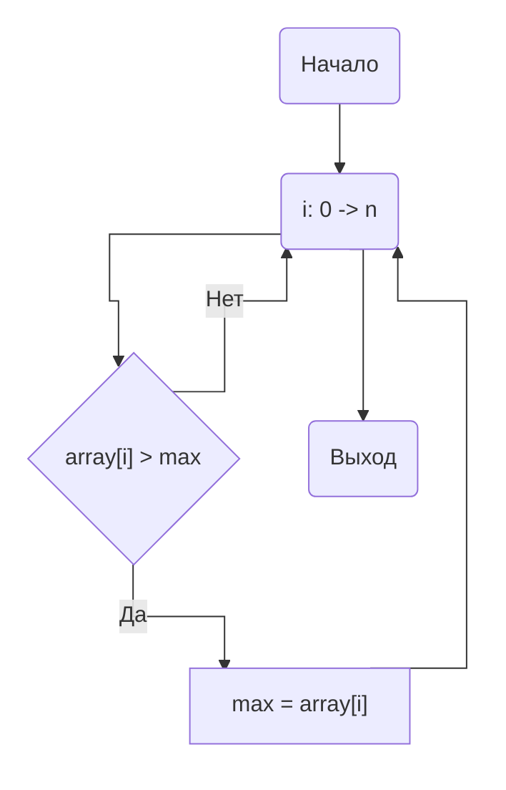
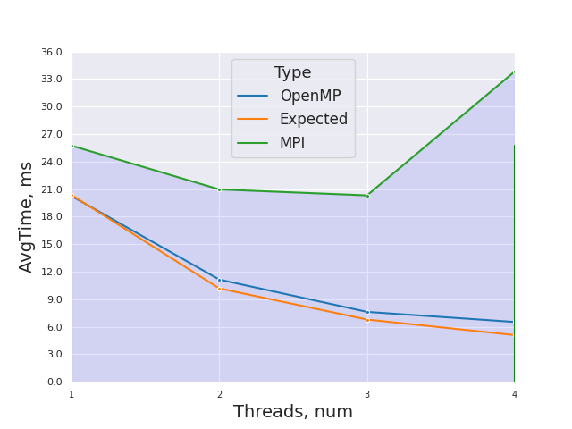
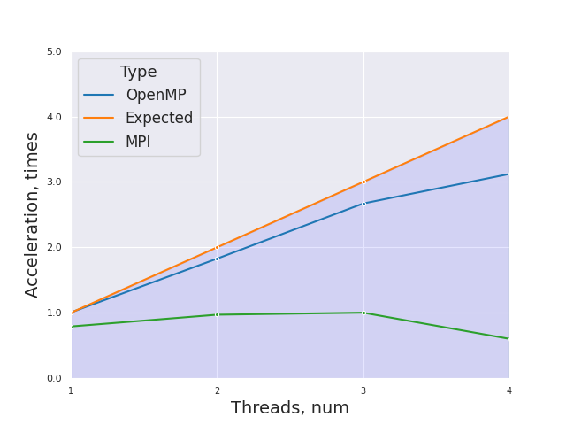
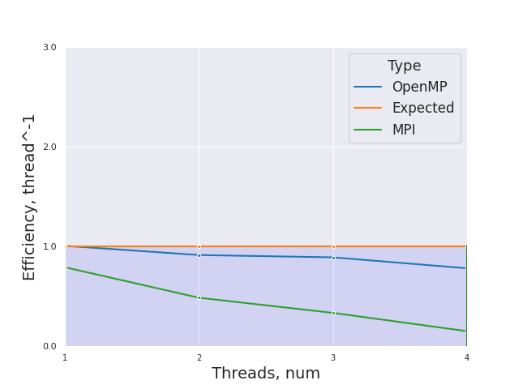

# НИЯУ МИФИ. Лабораторная работа №5. Воронков Андрей, Б20-505. 2022

## Используемая система

```
5.19.6-arch1-1 x86_64

CPU:
  Info: quad core model: Intel Core i7-8550U bits: 64 type: MT MCP cache:
    L2: 1024 KiB
  Speed (MHz): avg: 2000 min/max: 400/4000 cores: 1: 2000 2: 2000 3: 2000
    4: 2000 5: 2000 6: 2000 7: 2000 8: 2000
```
## Среда разработки 

- Язык программирования C
- Версия gcc: `gcc (GCC) 12.2.0`
- Версия OpenMP: `Release: 201511 OpenMP: 4.5`
- Версия OpenMPI: `mpirun (Open MPI) 4.1.4`


## Анализ алгоритма 

### Принцип работы

Приложенный алгоритм идет по массиву чисел и сравнивает их с текущим максимумом для данного процесса. Если элемент оказывается больше, то в переменную lmax записывается значение этого элемента. После выполнения итерационной части процесса, полученное внутри процесса значение lmax сравнивается с max из них выбирается наибольший. Таким образом наибольший элемент будет в max.

### Блок-схема





### Оценка сложности

**n** - количество чисел в массиве

- Сложность последовательного алгоритма - **O(n)**
 
## Вычисления

- Последовательный алгоритм
    - Average time of work 0.020356 seconds

- Параллельный алгортим OpenMPI
    - [Результаты работы](scripts/parallel_results.txt)

## Экспериментальные данные

### Зависимость времени от количества потоков



### Зависимость ускорения от количества потоков




### Зависимость эффективности работы программы от количества потоков




## Заключение

В ходе данной работы с использованием OpenMPI в языке программирования C было установлено то, что данная технология не дает выигрыша в скорости при использовании для распараллеливания на одном компьютере (лучше для этих целей использовать OpenMP), так как мы теряем в скорости во время общения между процессами. OpenMPI - это мощный инструмент для распределенных кластерных вычислений. По графикам видно, что при любом количестве потоков мы ухудшаем результат даже по сравнению с последовательными вычислениями, а для количества процессов больше количества физических ядер время выполнения увеличивается в разы.

## Приложение
### Исходный код параллельной программы:

```c
#include <time.h>
#include <stdlib.h>
#include <stdio.h>
#include <mpi.h>

#define MROWS 100

int main(int argc, char** argv)
{
	int ret  = -1;	///< For return values
	int size = -1;	///< Total number of processors
	int rank = -1;	///< This processor's number

	const int count = 10000000; ///< Number of array elements
	// printf("DEFAULT VALUE - %d\n\n", DEBUG);
	const int random_seed = time(NULL); ///< RNG seed

	int* array = 0; ///< The array we need to find the max in
	int lmax = -1;	///< Local maximums
	int  max = -1;  ///< The maximal element

	double end, start;

	// * GENERATE TRACEFILE

	/* Initialize the MPI */
	ret = MPI_Init(&argc, &argv);
	if (!rank) { printf("MPI Init returned (%d);\n", ret); }

	/* Determine our rankand processor count */
	MPI_Comm_size(MPI_COMM_WORLD, &size);
	// printf("MPI Comm Size: %d;\n", size);
	MPI_Comm_rank(MPI_COMM_WORLD, &rank);
	// printf("MPI Comm Rank: %d;\n", rank);

	/* Allocate the array */
	array = (int*)malloc(count * sizeof(int));

	// ! Master generates the array */
	if (!rank) {
		/* Initialize the RNG */
		srand(random_seed);
		/* Generate the random array */
		for (int i = 0; i < count; i++) { array[i] = rand(); }
	}

	start = MPI_Wtime();

	//printf("Processor #%d has array: ", rank);
	//for (int i = 0; i < count; i++) { printf("%d ", array[i]); }
	//printf("\n");

	/* Send the array to all other processors */
	MPI_Bcast(array, count, MPI_INTEGER, 0, MPI_COMM_WORLD);

	// printf("Processor #%d has array: ", rank);
	// for (int i = 0; i < count; i++) { printf("%d ", array[i]); }
	// printf("\n");

	const int wstart = (rank    ) * count / size;
	const int wend   = (rank + 1) * count / size;

	// printf("Processor #%d checks items %d .. %d;\n", rank, wstart, wend - 1);

	for (int i = wstart;
		i < wend;
		i++)
	{
		if (array[i] > lmax) { lmax = array[i]; }
	}

	// printf("Processor #%d reports local max = %d;\n", rank, lmax);

	MPI_Reduce(&lmax, &max, 1, MPI_INTEGER, MPI_MAX, 0, MPI_COMM_WORLD);

	end = MPI_Wtime();
	ret = MPI_Finalize();
	// if (!rank) { 
	// 	printf("*** Global Maximum is %d;\n", max);
	// }
	if (!rank) {
		printf("%lf ", end-start);
	}// printf("MPI Finalize returned (%d);\n", ret);

	return(0);
}
```

    
