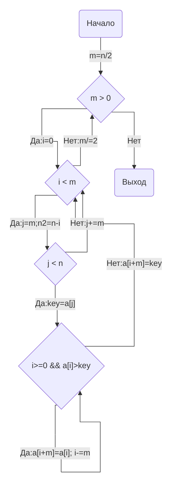
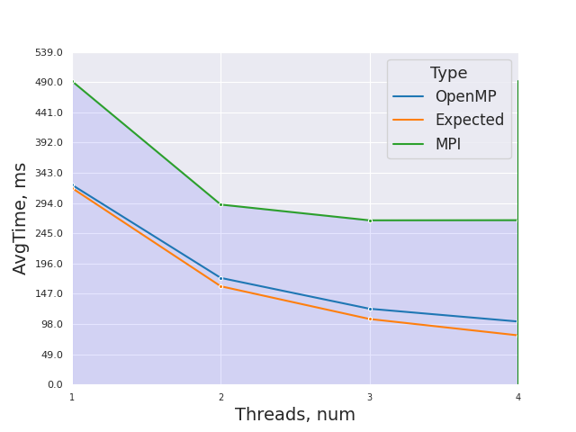
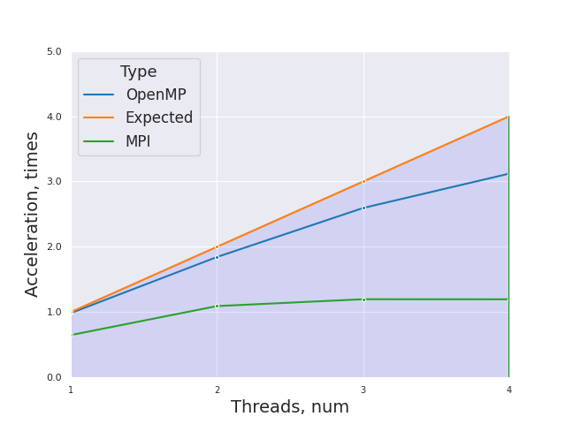
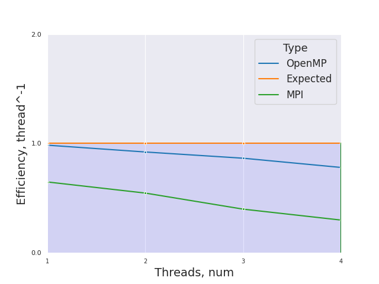

# НИЯУ МИФИ. Лабораторная работа №6. Воронков Андрей, Б20-505. 2022

## Используемая система

```
5.19.6-arch1-1 x86_64

CPU:
  Info: quad core model: Intel Core i7-8550U bits: 64 type: MT MCP cache:
    L2: 1024 KiB
  Speed (MHz): avg: 2000 min/max: 400/4000 cores: 1: 2000 2: 2000 3: 2000
    4: 2000 5: 2000 6: 2000 7: 2000 8: 2000
```
## Среда разработки 

- Язык программирования C
- Версия gcc: `gcc (GCC) 12.2.0`
- Версия OpenMP: `Release: 201511 OpenMP: 4.5`
- Версия OpenMPI: `mpirun (Open MPI) 4.1.4`


## Анализ алгоритма 

### Принцип работы

### Блок-схема





### Оценка сложности

- Лучший случай **O(n*log(n))**, когда массив отсортирован
- Худший случай **O(n^2)** (этот случай имеет место для N, равного степени двойки, когда элементы, большие и меньшие медианы, занимают нечетные и четные позиции соответственно, поскольку они сравниваются только на последнем проходе.)

 
## Вычисления

- Последовательный алгоритм
    - Average time of work 0.318274 seconds

- Параллельный алгортим OpenMPI
    - [Результаты работы](scripts/parallelmpi_results.txt)

## Экспериментальные данные

### Зависимость времени от количества потоков



### Зависимость ускорения от количества потоков




### Зависимость эффективности работы программы от количества потоков




## Заключение

В ходе данной работы с использованием OpenMPI в языке программирования C было установлено то, что данная технология не дает выигрыша в скорости при использовании для распараллеливания на одном компьютере (лучше для этих целей использовать OpenMP), так как мы теряем в скорости во время общения между процессами. OpenMPI - это мощный инструмент для распределенных кластерных вычислений. По графикам видно, что при любом количестве потоков мы ухудшаем результат даже по сравнению с последовательными вычислениями, а для количества процессов больше количества физических ядер время выполнения увеличивается в разы. Тем не менее OpenMPI показал себя лучше на более сложных вычислениях (по сравнению с опытом в лабораторной номер).

## Приложение
### Исходный код параллельной программы 

```c
#include <stdlib.h>
#include <stdio.h>
#include <mpi.h>

void insertionsort(int a[], int n, int stride) {
    for (int j=stride; j<n; j+=stride) {
        int key = a[j];
        int i = j - stride;
        while (i >= 0 && a[i] > key) {
            a[i+stride] = a[i];
            i-=stride;
        }
        a[i+stride] = key;
    }
}

void shellsort(int a[], int n)
{
    int i, m;
    for(m = n/2; m > 0; m /= 2)
    {
            for(i = 0; i < m; i++)
                insertionsort(&(a[i]), n-i, m);
    }
}


int main(int argc, char** argv)
{
	const int count = 1000000;     ///< Number of array elements
    const int random_seed = 123123; ///< RNG seed
    int size = -1;	
	int rank = -1;
    MPI_Status status;
    double start, end;

    /* Initialize the RNG */
    srand(random_seed);
    
    int* array = 0; 
    /* Generate the random array */
    array = (int*)malloc(count*sizeof(int));

    MPI_Init(&argc, &argv);
    MPI_Comm_size(MPI_COMM_WORLD, &size);
    MPI_Comm_rank(MPI_COMM_WORLD, &rank);

    if (!rank) {
		/* Generate the random array */
		for (int i = 0; i < count; i++) { array[i] = rand(); }
	}
    int step = count / size;
    int *partArray;


    if (!rank){
         for (int i = 1; i < size; i++) {
            MPI_Send(array + step * (i - 1), step, MPI_INT, i, 0, MPI_COMM_WORLD);
        }
        start = MPI_Wtime();
        int partArraySize = count - step * (size - 1);
        partArray = (int*)malloc(partArraySize*sizeof(int));
        for (int i = step * (size - 1); i < count; i++) {
            partArray[i - step * (size - 1)] = array[i];
        }
        shellsort(partArray, partArraySize);
        int *newArray = (int*)malloc(count*sizeof(int));
       
        for (int i = 0; i < partArraySize; i++) {
            newArray[i] = partArray[i];
        }
        for (int i = 1; i < size; i++) {
            MPI_Recv(newArray + step * (i - 1) + partArraySize, step, MPI_INT, MPI_ANY_SOURCE, 1, MPI_COMM_WORLD, &status);
        }
        shellsort(newArray, count);
        end = MPI_Wtime();
        printf("%lf ", end-start);
    } else{
        partArray = (int*)malloc(step * sizeof(int));;
        MPI_Recv(partArray, step, MPI_INT, 0, 0, MPI_COMM_WORLD, &status);
        shellsort(partArray, step);
        MPI_Send(partArray, step, MPI_INT, 0, 1, MPI_COMM_WORLD);
    }

    MPI_Finalize();

    free(array);    

	return(0);
}
```

    
